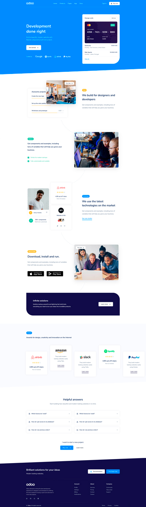

# Technical Challenge - Mockup to Static HTML Page Conversion
Welcome to the technical challenge to turn this exciting mockup into a static HTML page! In this challenge, we use HTML, Bootstrap (v4.6.x), and CSS (vanilla or SCSS) skills to bring this creative mockup to life.

# Original Mockup

# Requirements and Implementation Guide

- Use Bootstrap v4.6, taking advantage of SCSS variables and maps whenever possible.
- The final layout should look correct in a viewport with size ≥ 992px.
- Do not expect a pixel-perfect exact reproduction of the mockup, feel free to adapt the layout and design as you see fit.
- Make sure the 5 boxes in the "Awards" section are clickable with a hover effect.
- The "Useful answers" section should contain a fully functional accordion.
- Feel free to include comments and notes in your code to make it easier to understand.

# Strengths and Areas for Improvement

### Positive Points:

- Content distribution is effective and attractive.
- Animations engage the user.
- Eye-catching colors with good contrasts are used.
- The use of icons adds a fun touch to the design.

### Areas for Improvement:

- In the "Tools" section, the video can cover part of the content in the left frame. This section has been rearranged to improve the display.
- It is suggested to add more color accents to highlight other parts of the information and prevent the design from becoming flat.
- Consider adding a bolder background to improve the overall aesthetics of the page.

# Publication

This site was built using [GitHub Pages](https://cyncaro.github.io/Odoo-HTML-static-page/src/)